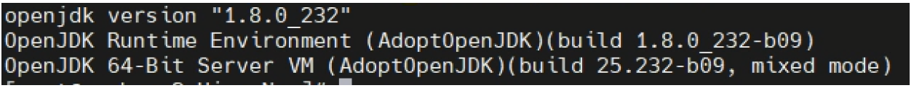
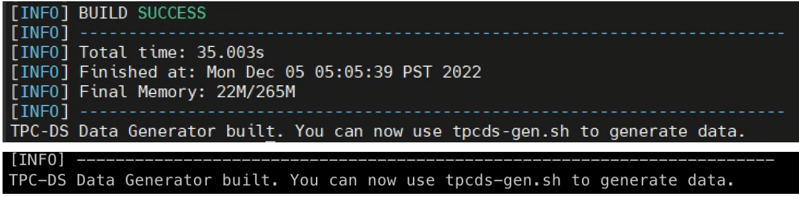

# TPC-DS tools for Apache Hive

The hive-tpcds-kit is a package that generates data and provides with a set of queries that you can experiment with Apache Hive at scale. This kit allows you to experience base Hive performance on large datasets, and gives an easy way to see the impact of Hive tuning parameters and advanced settings.

See [README_tpcds.md](./README_tpcds.md) for mods to the 'tpcds' process that include new `hive` support (only need a hive gateway to run this), multiple dimension testing, and performance reviews/comparisons.

If you use this repo for any results publication, please see [Fair Use of TPC Benchmarks](http://www.tpc.org/tpc_documents_current_versions/pdf/tpc_fair_use_quick_reference_v1.0.0.pdf).

## Citation
All the scripts are cloned from the repo [https://github.com/cloudera/impala-tpcds-kit](https://github.com/dstreev/hive-testbench.git) and modified as per our requirement. 

The automation part of running the tpc queries(Step 4) is cloned from the repo https://github.com/kcheeeung/hive-benchmark. 


## Step 0: Environment Setup

Before you begin, ensure gcc is installed and available on your system path. If your system does not have it, install it using yum or apt-get.

```
yum install -y gcc
```

## Step 1: Build

### Note:-

Before running the tpcds-build, please consider the below points. 

* Ensure that unzip package is installed. If not installed, install it and rerun the tpcds-build.sh script again.

* Ensure you set JAVA_HOME properly. The script tries to check for java at $JAVA_HOME/bin/java. In order to validate whether you have set the JAVA_HOME variable, run the below command.
```
$JAVA_HOME/bin/java -version
```
* If you get the output of the above command, which is Java version, similar to the screenshot below, then the JAVA_HOME is set properly. 




### Build Steps: 

* Compile and package the appropriate data generator: Running tpcds-build.sh downloads, compiles and packages the TPC-DS data generator. 

```
cd hive-tpcds-kit 
./tpcds-build.sh 
```

* After triggering this script, there will be many resources that will be downloaded from the maven repository. You should see a SUCCESS message as shown below once the script execution is complete. 



## Step 2: Data Generation 

Run tpcds-gen.sh with the below command. The scale-factor is in GB. Below are some of the values that you can use to run it. Recommended value is 1T, however, you can run it for higher volume as well. 


Data volume  | scale-factor
------------ | ------------
500G         | 500
1T           | 1000
2T           | 2000
5T           | 5000 

```
nohup sh tpcds-gen.sh --scale <scale-factor> --dir <HDFS_DIR_for_data _gen> > tpcds-gen-log &

Ex:- For 500G, 
nohup sh tpcds-gen.sh --scale 500 --dir /tmp/TPC-DS/Hive > tpcds-gen-log &

To check the live logs, 
tail -f <log-file-name>
```

Also, please note that this step will take a lot of time based on the underlying infrastructure. That’s why, we have given a command which runs the script in background and you can keep checking the logs to see the progress. 

### Note:-
* After submitting this script, if you see an error like No such file or directory, then worry not. The script will create a directory with name as the scale factor you passed in the command. This error will not lead to the failure of the script. 
* **DO NOT CREATE THE DIRECTORY WITH THE SCALE FACTOR NAME YOURSELF**. For example, in the above scenario, do not create the directory /tmp/TPC-DS/Hive/500 before running the script. It might result in failure of data generation, even though the script output might say otherwise. 

Additionally, you can also check how much data has been generated with the below command. 

```
hadoop fs -du -h <HDFS_DIR_for_data _gen>
```

If you see the increasing data in the output of the above command, then you can confirm that the job is running fine. This job will create a new folder with scale-factor as the name and generate the data. Thus, in the above example, we will see the data generated corresponding to 500G in the /tmp/TPC-DS/Hive/**500** directory.

The data generation is done with the help of a MR job that runs with the name **GenTable+all_scale-factor** generating some data in the dir mentioned above with --dir. Also, it creates a Hive DB and loads the text data in all the tables. 

**Hive DB Name:** cdp_hive_tpcds_text_<scale_factor>

At the end of  script execution, you will see the output as shown below. 

----------- INSERT PICTURE HERE -----------

You can verify this by checking the contents of the aforementioned HDFS directory that is passed as the argument to the tpcds-gen.sh script. You should see similar output as the one shown below. 

----------- INSERT PICTURE HERE -----------

## Step 3: Data Load
  * Load the generated data: The script tpcds-setup.sh generates and loads data for TPC-DS. General usage is as shown below. 

```
./tpcds-setup.sh –scale <scale-factor> –dir <HDFS directory used for data gen>
```
  
  * This step will also take a lot of time based on the scale-factor. Thus, like in the Data Generation step, we will submit this job to run in background, as shown below.  

```
nohup sh tpcds-setup.sh –scale <scale-factor> –dir <HDFS directory used for data gen> > log_file_name &

Ex:- nohup sh tpcds-setup.sh –-scale 500 --dir /tmp/TPC-DS/Hive > tpcds-500-log &
```

  * In the previous step, a new DB will be created and it holds a new set of tables that will be created as part of this job. This new DB naming convention is **cdp_hive_tpcds_bin_partitioned_managed_orc_scale.**
    In this scenario, where we have used scale as 500, it will be **cdp_hive_tpcds_bin_partitioned_managed_orc_500**.

  *  Data from generated text files will be loaded in to a new DB, and the data will be stored as ORC in the different tables. We will use these set of tables to run the set of Hive queries for validation. 

  *  At the end of the script execution, you will see the output as shown below. 

----------- INSERT PICTURE HERE -----------


  *  Once all the tables are created, the next step is to run the TPC-DS queries and note down the timings each query takes. We have an automation that helps in running the set of queries and generates a .csv file with the query number and the time it took to run that query in Hive. 


## Step 4: Run Queries

Once all the tables are created, the next step is to run the TPC-DS queries and note down the timings each query takes. We have an automation that helps in running the set of queries and generates a .csv file with the query number and the time it took to run that query in Hive. 

* Update the paths for the below variables in _hive-tpcds-kit/query_runner.sh_ script. 
```
1. QUERY_BASE_NAME
2. SETTINGS_PATH
3. FINAL_REPORT_LOCATION (This should be HDFS location)
```
* Update the below details in util_internalRunQuery.sh script. 

```
(Line 17) Beeline command. Update the hostname, ssl details, kerberos principal details, truststore details and password. Change all those applicable.
```
* Run the script 
```
nohup sh query_runner.sh > <log_file_name> &
```

* When you trigger the _query_runner_ script, keep checking the job logs. If a query is taking too long, then kill the corresponding Tez application in Yarn from UI/cmdline. No need to terminate the script execution. Once that app is killed, the script will continue executing the next query.

* To check the logs, you can use the below command. 

```
tail -f <log_file_name>
```

* Once the query_runner script is complete, check the contents of the .csv file generated in the working directory. This will have the list of queries and the time it took to run each query. Share this with the Cloudera team and they will help you with validation of these results. 

* If time permits, we recommend to run this script, query_runner, for two more times so that we can have the results for 3 iterations and that would help us in validation. If you are planning to do this, ensure you backup all the files generated as part of this test, as it removes the files before starting. 

* This concludes the TPC-DS Hive testing. 
