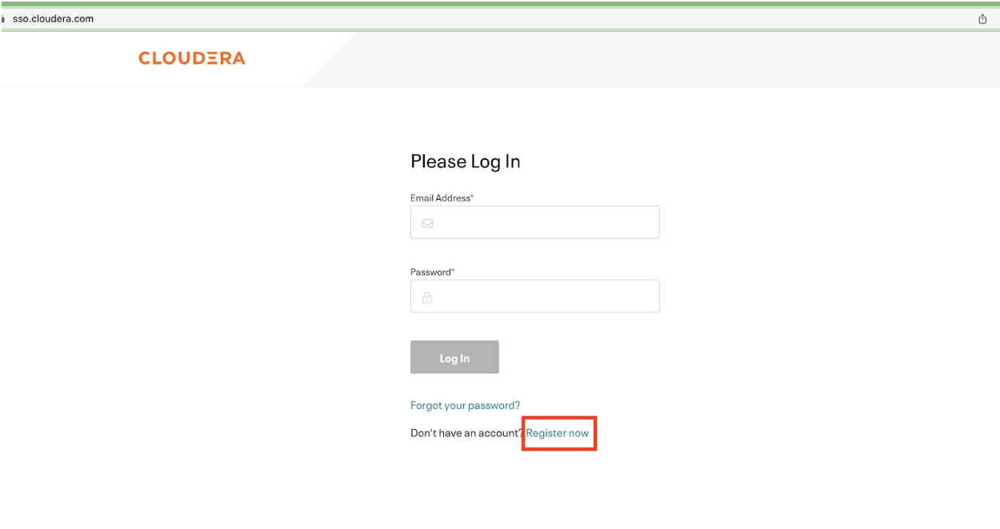
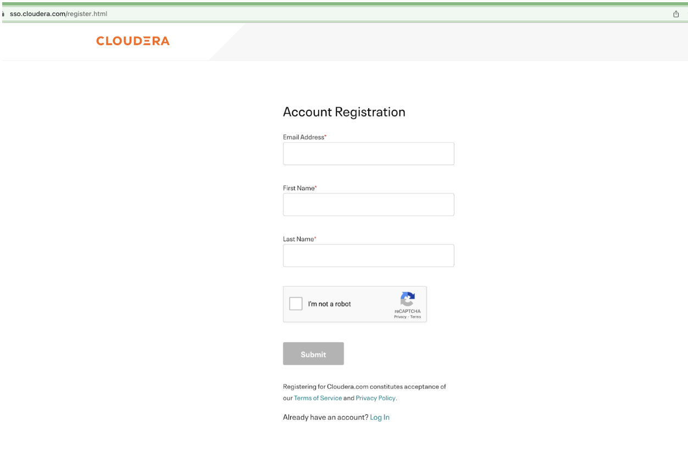
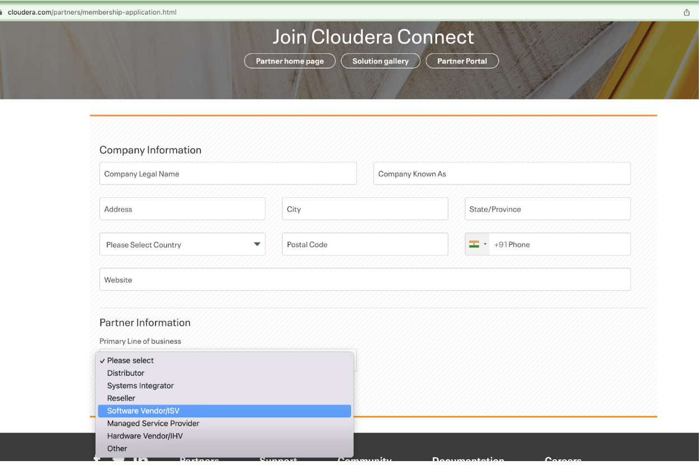
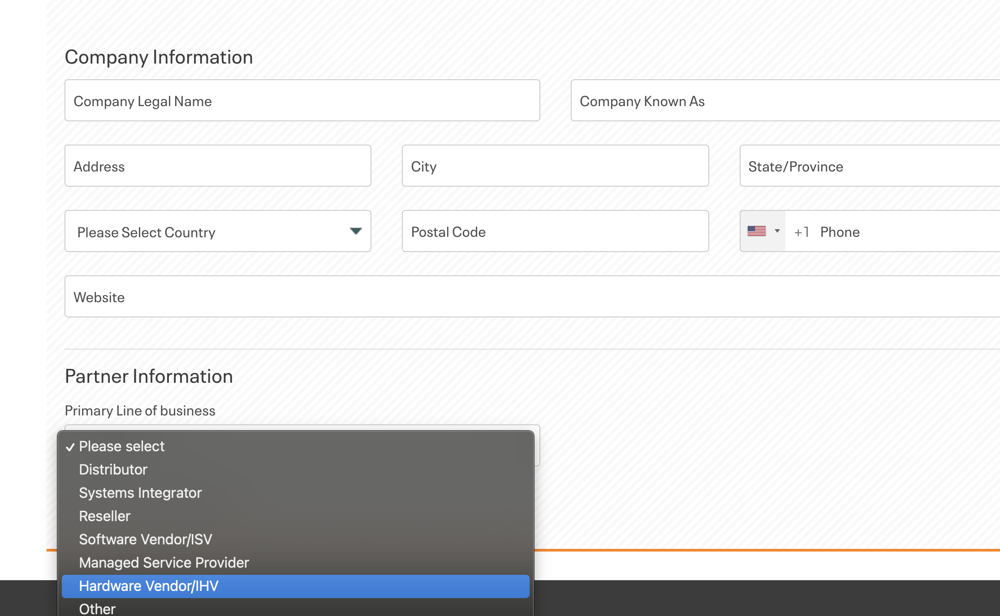
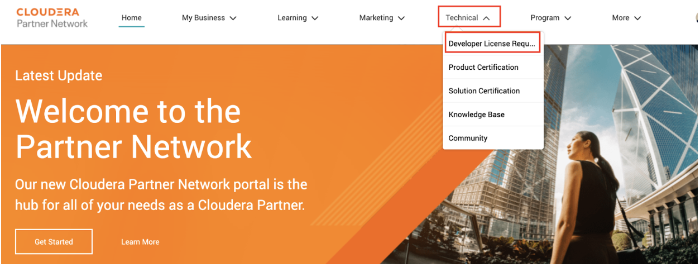
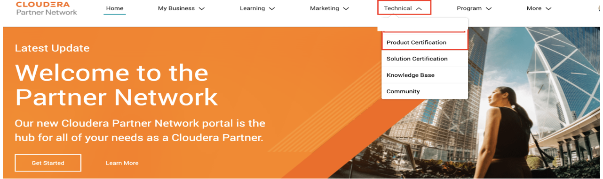

= CDP Certification Process
Puneet Joshi <puneetjoshi@cloudera.com>; Pannag Katti <pkatti@cloudera.com>

1.0, Feb 22, 2023

This document provides the details for Partners who are willing to integrate and validate their product (ISV) and hardware (IHV) on Cloudera Data Platform(CDP). Cloudera Data Platform  is a single platform that has two form factors CDP Public and CDP Private cloud. 

== Introduction

*CDP Public Cloud* is an integrated analytics and data management platform deployed on *cloud services*. It consists of a number of cloud services designed to address specific enterprise data cloud use cases.
This includes Data Hub powered by Cloudera Runtime, self-service experiences (Data Warehouse, Machine Learning, and Data Engineering) running on containers, the administrative layer (Management Console), and SDX services (Data Lake, Data Catalog, Replication Manager, and Workload Manager).

*CDP Private Cloud* is an integrated analytics and data management platform deployed in *private data centers*. It consists of CDP Private Cloud Base and CDP Private Cloud Data Services and offers broad data analytics and artificial intelligence functionality along with secure user access and data governance features.

---

This document outlines the steps to validate/integrate on CDP for,

* Independent Software Vendors *(ISV)* Partners who are willing to integrate their software products and validate it on any one of the CDP form factors or on both. 

* Independent Hardware Vendors *(IHV)* Partners who are willing to validate and test CDP Private Cloud form factor on their hardware. 

== Register on Cloudera SSO

_(*Skip the below steps and jump to <<partner_portal_access>> if you are already registered on Cloudera SSO.*)_

[.underline]*Step1:* Register yourself and your team members who will be working on this certification engagement in Cloudera SSO by accessing the below URL.

https://sso.cloudera.com/

NOTE: Make sure registration is done by using an official email id.

[.underline]*Step 2:* An activation code will be sent over the email. Please verify each registered email id by following the steps mentioned in that email.

[.underline]*Step 3:* After verification of the email id, you will be redirected to profile creation page. Please submit the required details to  complete the *SSO* account creation.

== Register on Cloudera Partner Portal [[partner_portal_access]]

[.underline]*Step1:* Please submit the form available at below URL. 

https://www.cloudera.com/partners/membership-application.html

image::images/Partner_Portal_Apply.png[]

_If prompted, login with your Cloudera SSO account._

[.underline]*Step 2:* Select the Primary Line Of Business field. 

* If you are an **ISV Partner** select “Software Vendor/ISV” in the Primary Line Of Business field. 

* If you are an **IHV Partner** select “Hardware Vendor/IHV” in the Primary Line Of Business field. 

[.underline]*Step 3:* Submit the application.

Once the above application is approved you will be notified over the email containing the URL to access the *Partner Portal*.

== Request For Development License

Once the access to Partner Portal is approved, please follow the below steps.

. Access the Partner Portal by using below url:
+
https://cloudera-portal.force.com/clouderapartners/s/

. Navigate to *_Technical_* dropdown and select *_Developer License Request_*.
+

. Fill in the required details:
+
.. Cloudera Contact(s) that you are working with
.. What Cloudera product are you requesting?(*Choose one*)
- CDP Public Cloud
- CDSW
- Data Flow
- HDP
- Data Plane
- CDH
- Private Cloud Base
- Private Cloud Data Services

.. Reason for request 

. Click Next and Submit

_(PS: It takes a couple of days for the request to get processed from here.)_

== For ISV Partners

=== Submit ISV Certification Request

. Access the Partner Portal by using below url:
+
https://cloudera-portal.force.com/clouderapartners/s/

. Navigate to *Technical* dropdown and select *Product Certification*.
+

. Fill in the required fields and submit the application.

_It will take a couple of days to review the request. Once approved an email will be sent._

=== ISV Product Integration

We recommend Partner to complete the ISV Production integration process in 2-4 weeks once all the above steps are completed and Partner has received the required credentials to download the binaries(Private cloud)/ access to CDP Management Console(Public Cloud). 

=== Post Integration
Once the integration between Partner’s software product and CDP Data Platform is tested and validated internally by Partner’s team . Partner needs to work with Cloudera Technical POC to schedule a Demo with Cloudera’s Global ISV certification team. The Cloudera POC will provide necessary information on the topics and other details for this integration demo.

After completing this step, Cloudera Team will review the overall integration and will notify the partner if any other details are needed.

After the final review from the Global Certification team, the partner will be notified through email. 

=== Post Certification of ISV Product

After successful completion of the ISV Certification request, the Partner and Cloudera Technical POC will work together to create a technology blog , GTM highlighting the architecture of the integration and underlying CDP Runtime Version, along with components which were used during this activity. 

== For IHV Partners

=== Validation Tests

In order to validate the CDP setup, Private Cloud Base or Data Services, we provide a test suite that contains a set of tests to be run and a detailed instruction guide on how to run these. These test scripts generate a result sheet for each test. Once all the tests are run, please share the result sheets along with other metrics that the Cloudera partner team may advise you to note down during the execution of these tests.

=== Post Validation of IHV Setup

After reviewing the test results shared by the Partner, the Cloudera team reviews all the results and provides necessary feedback on the same and recommendations to rerun tests, if any test result is not up to the expected benchmark. Once all the results are satisfactory, the Cloudera team confirms the *Field Validation of the CDP setup on the partner hardware*. Post this, the Partner and Cloudera Technical POC will work together to create a technology blog, GTM highlighting the hardware configuration, architecture, validation results, and underlying CDP Runtime Version, along with components which were used during this. 

---

A technical POC will be assigned to Partner who will help in setting up Cloudera Data Platform
Infrastructure.  It is advisable to run this joint effort as a Project and regular cadence calls with POC and Partner’s team is expected to complete/resolve the issues which appear. 

Please review the below points to have a better understanding.

== Appendix

=== CDP Private Cloud Base

If you are planning to certify CDP base, then the Cloudera POC will share the guide that contains the steps to install CDP Base , Pre-requisites , and how to enable other mandatory services like Kerberos, TLS,

Please note that if you need any help in installing the CDP Base, mention that in the initial discussion with the POC.

=== CDP Private Cloud Data Services

If you are planning to certify CDP Data Services, there are a few things that need to be finalized as listed below. 

. Hardware requirements for Base
. Hardware requirements for Private Cloud
. Security and Authentication mechanism
. Choice of Container Platform (ECS/OCP)

Initial discussions with the Cloudera team will be on these points. Once we decide on these, we will proceed with supporting you on the Base installation followed by which we will do a validation of Base before proceeding with the Private Cloud installation. After successful validation, you will get a guide for Private Cloud installation. 

Once you perform all the steps and are able to successfully register the environment in CDP Private Cloud, you can enable all the Data services. 

=== CDP Public Cloud

The technical POC from Cloudera will assist in setting up an environment on CDP Public Cloud tenant of Partner. Cloudera technical POC will help with the required details and configuration required for the underlying cloud provider. As the underlying cloud infrastructure account is owned by Partner it is expected that Partner will complete all the prerequisites configuration.

After the successful registration of the environment of Public Cloud, Cloudera technical POC will guide Partner to enable other PaaS offerings on CDP based on the ISV Certification request submitted earlier. Also the technical POC from Cloudera will assist the Partner’s team in resolving/troubleshooting any technical issues which appear during the integration.(limited to Cloudera Platform).

---